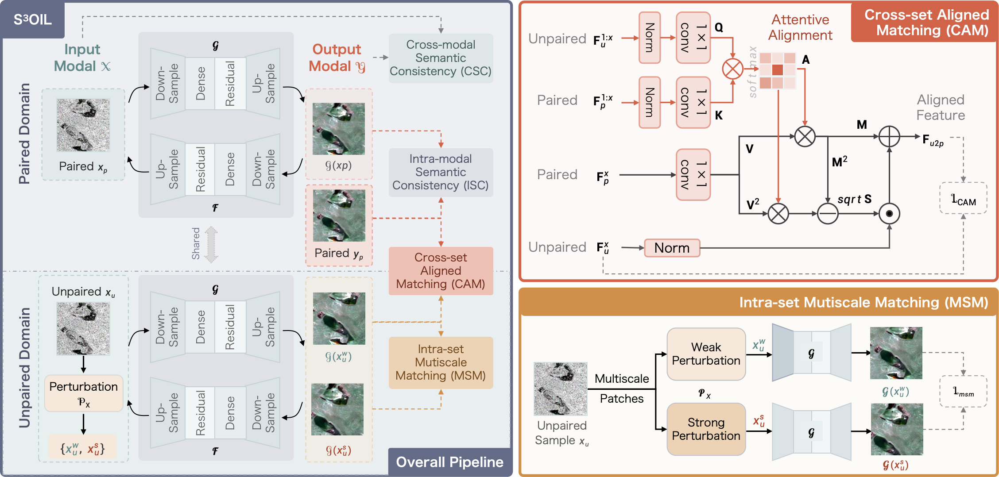
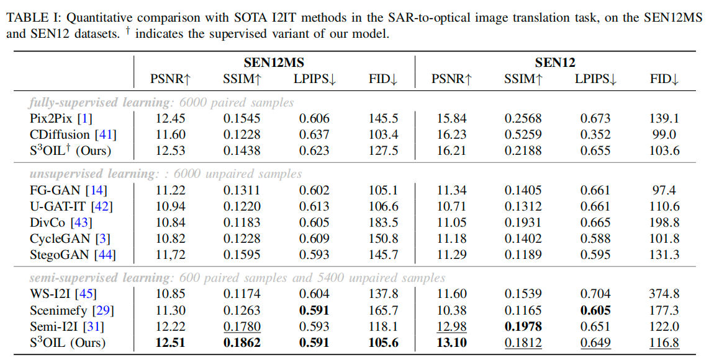
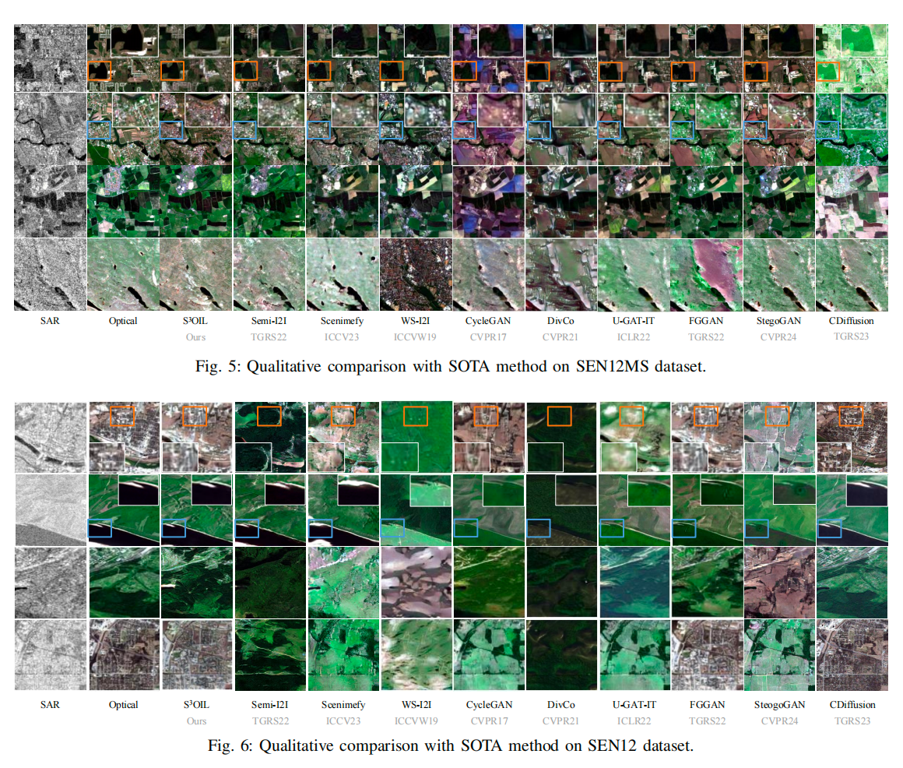

<div align="left">

# SOIL: [Semi-Supervised SAR-to-Optical Image Translation via Multi-Scale and Cross-Set Matching] (TIP 2025)

</div>

<p align="left">
Official PyTorch Implementation of SOIL
</p>

<p align="left">
  <a href="https://ieeexplore.ieee.org/document/11196005/">📄 Paper</a>
</p>

---

# Abstract

Image-to-image translation has achieved great success, but still faces the significant challenge of limited paired data, particularly in translating Synthetic Aperture Radar (SAR) images to optical images. Furthermore, most existing semi-supervised methods place limited emphasis on leveraging the data distribution. To address those challenges, we propose a Semi-Supervised SAR-to-Optical Image Translation (S3OIL) method that achieves high-quality image generation using minimal paired data and extensive unpaired data while strategically exploiting the data distribution. To this end, we first introduce a Cross-Set Alignment Matching (CAM) mechanism to create local correspondences between the generated results of paired and unpaired data, ensuring cross-set consistency. In addition, for unpaired data, we apply weak and strong perturbations and establish intra-set Multi-Scale Matching (MSM) constraints. For paired data, intra-modal semantic consistency (ISC) is presented to ensure alignment with the ground truth. Finally, we propose local and global cross-modal semantic consistency (CSC) to boost structural identity during translation. We conduct extensive experiments on SAR-to-optical datasets and another sketch-to-anime task, demonstrating that S3OIL delivers competitive performance compared to state-of-the-art unsupervised, supervised, and semi-supervised methods, both quantitatively and qualitatively. Ablation studies further reveal that S3OIL can ensure the preservation of both semantic content and structural integrity of the generated images.Multi-modal remote sensing image translation aims to bridge the domain gap between heterogeneous sensors while preserving structural consistency and semantic information. However, existing methods often suffer from distribution discrepancies between paired and unpaired samples, as well as structural distortions caused by stochastic diffusion processes. To address these challenges, we propose SOIL, a novel framework for heterogeneous remote sensing image translation. SOIL introduces a unified feature alignment strategy to effectively integrate paired and unpaired training data while maintaining structural fidelity during translation. Extensive experiments on multiple remote sensing datasets demonstrate that the proposed method achieves superior quantitative and qualitative performance compared with state-of-the-art approaches.

---

# Framework Overview

<p align="center">
  
</p>

The overall architecture of SOIL. The framework jointly exploits paired and unpaired samples through a feature alignment mechanism, enabling robust cross-modal image translation while preserving semantic and structural information.

---

# Experimental Results

## Quantitative Comparison

<p align="center">
  
</p>

SOIL consistently outperforms existing methods across multiple evaluation metrics.

## Qualitative Comparison

<p align="center">
  
</p>

Visual comparisons demonstrate that SOIL generates images with better structural consistency and richer details.

---


# Environment

bash Python 3.10 PyTorch 2.0+ CUDA 11.8

# Citation

If you find this project useful for your research, please consider citing:

```bibtex
@article{11196005,
author={Yang, Xi and Shi, Haoyuan and Li, Ziyun and Qiao, Maoying and Gao, Fei and Wang, Nannan},
journal={IEEE Transactions on Image Processing},
title={S3OIL: Semi-Supervised SAR-to-Optical Image Translation via Multi-Scale and Cross-Set Matching},
year={2025},
volume={34},
number={},
pages={6641-6654},
keywords={Semantics;Translation;Optical sensors;Synthetic aperture radar;Optical imaging;Feature extraction;Data models;Semisupervised learning;Accuracy;Noise;Semi-supervised learning;cross-set alignment matching (CAM);multi-scale matching (MSM);intra-modal semantic consistency (ISC);cross-modal semantic consistency (CSC)},
doi={10.1109/TIP.2025.3616576}}

```


<div align="center">

⭐ If you find this repository useful, please consider giving it a star.

</div>
